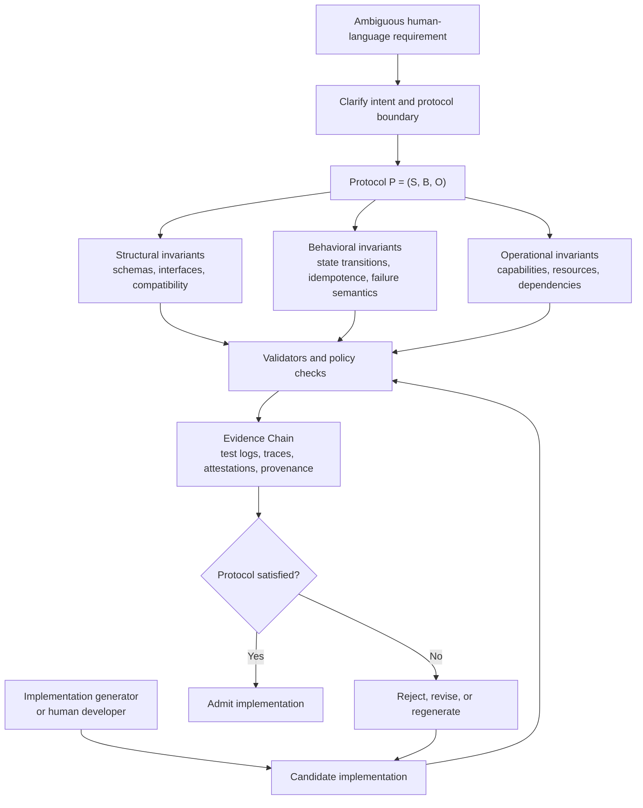

# PDD Protocol Author

A Codex skill for turning ambiguous human-language software requirements into Protocol-Driven Development (PDD) bundles.

The skill helps developers clarify intent, expose ambiguity, and draft machine-checkable protocol artifacts:

- typed handshakes
- structural invariants
- behavioral invariants
- operational invariants
- capability manifests
- ambiguity logs
- validation plans
- evidence requirements

## Paper

This skill is based on the arXiv paper [Protocol-Driven Development: Governing Generated Software Through Invariants and Evidence](https://arxiv.org/abs/2605.12981).

The diagram below summarizes the paper's core governance loop: generated code is replaceable, while the protocol and evidence chain decide admission.



```bibtex
@misc{he2026protocoldrivendevelopmentgoverninggenerated,
      title={Protocol-Driven Development: Governing Generated Software Through Invariants and Evidence},
      author={Jun He and Deying Yu},
      year={2026},
      eprint={2605.12981},
      archivePrefix={arXiv},
      primaryClass={cs.SE},
      url={https://arxiv.org/abs/2605.12981},
}
```

## Install For Codex

Copy the skill folder into your Codex skills directory:

```bash
git clone https://github.com/openkedge/pdd-protocol-author.git
mkdir -p ~/.codex/skills
cp -R pdd-protocol-author ~/.codex/skills/
```

Then ask Codex:

```text
Use $pdd-protocol-author to convert this requirement into a PDD bundle with structural, behavioral, and operational invariants.
```

## Install For Claude Code

Claude Code supports Agent Skills as folders containing a `SKILL.md` file and optional supporting files. Personal skills live in `~/.claude/skills/`; project skills live in `.claude/skills/` inside a repository.

Install as a personal Claude Code skill:

```bash
git clone https://github.com/openkedge/pdd-protocol-author.git
mkdir -p ~/.claude/skills
cp -R pdd-protocol-author ~/.claude/skills/
```

Install as a project skill shared with a team:

```bash
git clone https://github.com/openkedge/pdd-protocol-author.git
mkdir -p .claude/skills
cp -R pdd-protocol-author .claude/skills/
git add .claude/skills/pdd-protocol-author
git commit -m "Add PDD Protocol Author skill"
```

Restart Claude Code after installing so it reloads available skills. Then ask:

```text
Use the PDD Protocol Author skill to convert this requirement into a protocol bundle.
```

Claude Code can also activate the skill automatically when your request matches the skill description.

Reference: [Claude Code Agent Skills documentation](https://docs.claude.com/en/docs/claude-code/skills).

## Install For Kiro

Kiro supports Agent Skills from global and workspace skill folders. Global skills live in `~/.kiro/skills/`; workspace skills live in `.kiro/skills/` inside a project.

Install as a global Kiro skill:

```bash
git clone https://github.com/openkedge/pdd-protocol-author.git
mkdir -p ~/.kiro/skills
cp -R pdd-protocol-author ~/.kiro/skills/
```

Install as a workspace skill:

```bash
git clone https://github.com/openkedge/pdd-protocol-author.git
mkdir -p .kiro/skills
cp -R pdd-protocol-author .kiro/skills/
git add .kiro/skills/pdd-protocol-author
git commit -m "Add PDD Protocol Author skill"
```

In Kiro, invoke it directly as a slash command:

```text
/pdd-protocol-author
```

or ask naturally:

```text
Convert this feature request into a PDD bundle with typed handshakes, invariants, validator plan, and evidence requirements.
```

Kiro IDE also supports importing skills from a local folder through the Agent Steering & Skills panel. If importing from GitHub, Kiro expects a URL pointing to a skill folder or `SKILL.md`; cloning and importing the local folder is the most reliable path for this repository layout.

Reference: [Kiro Agent Skills documentation](https://kiro.dev/docs/skills/) and [Kiro CLI Agent Skills documentation](https://kiro.dev/docs/cli/skills/).

## Example

Input:

```text
Build an API that creates a user if one does not exist. It should be safe to retry and should not call external services.
```

The skill produces a PDD bundle containing:

```text
pdd-bundles/<protocol-name>/
├── protocol.yaml
├── schemas/
│   ├── request.schema.json
│   └── response.schema.json
├── capability-manifest.yaml
├── invariants/
│   ├── structural.yaml
│   ├── behavioral.yaml
│   └── operational.yaml
├── validators/
│   └── validation-plan.yaml
├── ambiguity-log.md
└── evidence-requirements.yaml
```

## Validate A Bundle

The skill includes a lightweight structural validator:

```bash
python3 scripts/validate_pdd_bundle.py assets/templates
```

## Core Idea

PDD treats implementation as replaceable and protocol as durable. Natural language starts the design process, but the permanent artifact is a bundle of explicit constraints that can be validated.

```text
Code is transient; protocol is sovereign.
```
